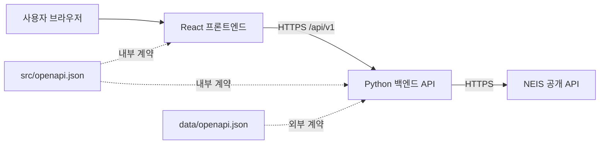

# 급식 배틀 - 학교 급식 조회 앱 기술 요구사항

## 1. 문서 개요

### 1.1 문서 메타데이터

| 항목 | 내용 |
|------|------|
| 문서명 | 급식 배틀 - 학교 급식 조회 앱 기술 요구사항 |
| 문서 버전 | 1.0 |
| 문서 상태 | 승인 |
| 승인 상태 | 승인 완료 |
| 작성자 | 프로젝트 팀 |
| 기술 책임자 | 미정 |
| 검토자 | 미정 |
| 승인자 | 프로젝트 소유자 |
| 작성일 | 2026-08-17 |
| 최종 수정일 | 2026-08-17 |
| 목표 릴리스 | MVP |
| 기준 PRD | [`PRD.md`](PRD.md) 1.1 |
| 관련 이슈 | [#4 `PRD.md` 및 `TRD.md` 문서 생성하기](https://github.com/duc-ke/bsl-pyconkr/issues/4) |
| 외부 API 명세 | [`data/openapi.json`](data/openapi.json) |
| 내부 API 명세 | 구현 시 생성할 `src/openapi.json` |

### 1.2 변경 이력

| 버전 | 날짜 | 작성자 | 변경 내용 |
|------|------|--------|-----------|
| 0.1 | 2026-08-17 | 프로젝트 팀 | 최초 기술 설계, 내부 API 계약 및 테스트 전략 정의 |
| 0.2 | 2026-08-17 | 프로젝트 팀 | 검색어 최소 길이와 조회 가능 기간·기본 범위 정책 반영 |
| 0.3 | 2026-08-17 | 프로젝트 팀 | 모든 애플리케이션 코드를 `src` 하위 구조로 통합 |
| 1.0 | 2026-08-17 | 프로젝트 팀 | 검토 완료 및 기술 요구사항 승인 |

## 2. 목적과 범위

이 문서는 승인된 `PRD.md` 1.0을 구현하기 위한 시스템 구조, 구성 요소의 책임,
프론트엔드와 백엔드 사이의 API 계약, 외부 NEIS API 연동, 실행 환경 및 테스트
전략을 정의한다.

MVP는 학교 검색, 날짜 범위 선택 및 중식 조회만 제공한다. 인증, 사용자 데이터,
투표, 학교 간 자동 비교 및 AI 분석은 기술 범위에 포함하지 않는다.

## 3. 기술 목표와 원칙

- 브라우저는 NEIS API를 직접 호출하지 않고 백엔드 API만 호출한다.
- 외부 NEIS 계약과 내부 애플리케이션 계약을 분리한다.
- `src/openapi.json`을 프론트엔드·백엔드 통신 계약의 단일 기준으로 사용한다.
- 외부 응답은 백엔드 경계에서 검증하고 내부 응답 모델로 정규화한다.
- 데이터 없음, 입력 오류, 외부 API 오류를 서로 다른 상태로 전달한다.
- UI는 접근 가능한 미니멀 벤토 그리드를 기본으로 하며 글래스 효과는 떠 있는
  표면에만 제한한다.
- 구현과 테스트는 같은 OpenAPI 계약을 기준으로 검증한다.
- 모든 애플리케이션과 테스트 코드는 `src` 아래에 두고, 웹은 `src/web`,
  API는 `src/api`, E2E는 `src/e2e`에서 관리한다.

## 4. 시스템 아키텍처



### 4.1 요청 흐름

1. 프론트엔드는 사용자의 학교 검색어를 내부 학교 검색 API로 전송한다.
2. 백엔드는 입력을 검증하고 `data/openapi.json`에 정의된 NEIS 학교정보 API를
   호출한다.
3. 백엔드는 NEIS 응답을 내부 학교 모델로 정규화해 프론트엔드에 반환한다.
4. 프론트엔드는 선택한 학교 코드와 교육청 코드, 날짜 범위를 내부 급식 API로
   전송한다.
5. 백엔드는 NEIS 급식식단정보 API를 중식 조건으로 호출한다.
6. 백엔드는 메뉴·영양·원산지의 구분 문자열을 구조화된 배열로 변환하고
   날짜순으로 반환한다.

## 5. 권장 기술 구성

### 5.1 프론트엔드

| 영역 | 권장 기술 | 선택 이유 |
|------|-----------|-----------|
| UI 애플리케이션 | React + TypeScript | 컴포넌트 기반 UI와 정적 타입 계약 |
| 개발·빌드 | Vite | 빠른 개발 서버와 단순한 프로덕션 빌드 |
| 서버 상태 | TanStack Query | 로딩·오류·재시도·요청 캐시의 일관된 처리 |
| 날짜 처리 | date-fns | 날짜 비교와 한국어 표시를 명시적으로 처리 |
| 날짜 선택 | 접근 가능한 Date Range Picker | 연속된 시작일·종료일 선택과 키보드 조작 |
| API 타입 | openapi-typescript | `src/openapi.json`에서 TypeScript 타입 생성 |
| 스타일 | CSS 변수와 컴포넌트 단위 CSS | 벤토 레이아웃과 제한적 글래스 효과를 가볍게 구현 |

데이트 피커 구현체는 한국어 로케일, 키보드 이동, 포커스 관리 및 날짜 범위
선택을 모두 지원해야 한다. 특정 UI 라이브러리를 선택할 경우에도 해당 요구를
충족하지 못하는 단일 날짜 선택기를 두 개 조합하는 방식보다 하나의 범위
선택기를 우선한다.

### 5.2 백엔드

| 영역 | 권장 기술 | 선택 이유 |
|------|-----------|-----------|
| API 프레임워크 | FastAPI | OpenAPI와 요청·응답 모델을 기본 지원 |
| 데이터 검증 | Pydantic | 외부 입력과 응답의 경계 검증 |
| HTTP 클라이언트 | HTTPX AsyncClient | 비동기 NEIS 요청과 테스트 대체 용이성 |
| 설정 | pydantic-settings | 환경 변수 검증과 설정 분리 |
| 패키지·프로젝트 관리 | uv | 가상환경, 의존성 설치, 잠금 및 명령 실행을 하나의 도구로 통합 |
| 애플리케이션 서버 | Uvicorn | ASGI 기반 FastAPI 실행 |

백엔드 Python 프로젝트는 `src/api/pyproject.toml`에 런타임 및 개발 의존성을
선언하고 `src/api/uv.lock`을 커밋한다. 로컬과 CI에서는 `uv sync --locked
--all-groups`로 잠금 파일과 동일한 환경을 구성하며, `pip` 또는 별도 가상환경
명령을 표준 절차로 사용하지 않는다.

개발 서버의 표준 실행 명령은 `src/api`에서 실행하는 `uv run uvicorn
app.main:app --reload`이다. 테스트와 그 밖의 Python 도구도 `uv run`으로
실행해 프로젝트 가상환경과 잠긴 의존성을 사용한다. 컨테이너는 개발용
`--reload` 없이 `uv run uvicorn app.main:app --host 0.0.0.0 --port 8000`으로
실행한다.

### 5.3 런타임과 배포

- 프론트엔드와 백엔드는 각각 별도 컨테이너 이미지로 빌드한다.
- Docker Compose가 두 서비스, 네트워크, 포트 및 환경 변수를 정의한다.
- 런타임 버전은 구현 시점의 지원 중인 LTS 또는 안정 버전을 선택하고
  Dockerfile과 잠금 파일에 고정한다.
- 프론트엔드가 사용하는 API 기본 URL은 환경별 설정으로 주입한다.
- 백엔드의 NEIS 기본 URL, API 키 및 허용 Origin은 환경 변수로 주입한다.
- 비밀값은 이미지, Compose 파일 또는 저장소에 기록하지 않는다.

## 6. 구성 요소 책임

### 6.1 프론트엔드 책임

- 학교 검색어, 선택 학교 및 날짜 범위 상태를 관리한다.
- 유효하지 않거나 완성되지 않은 입력의 전송을 방지한다.
- 내부 API 클라이언트를 통해서만 데이터를 요청한다.
- 로딩, 빈 결과, 입력 오류 및 서버 오류를 서로 구분해 표시한다.
- 메뉴와 급식 상세 정보를 안전한 텍스트와 목록으로 렌더링한다.
- 모바일·데스크톱 반응형 레이아웃과 키보드 접근성을 제공한다.

### 6.2 백엔드 책임

- 내부 API의 쿼리 매개변수와 응답 페이로드를 검증한다.
- `data/openapi.json`을 근거로 NEIS API 클라이언트를 별도 모듈에 구현한다.
- 학교 검색을 NEIS 학교기본정보 조회로 변환한다.
- 급식 조회에 선택 학교의 교육청 코드·학교 코드와 중식 코드를 적용한다.
- NEIS 형식의 날짜, HTML 줄바꿈 및 문자열 기반 수치를 내부 모델로 정규화한다.
- 외부 API의 오류와 타임아웃을 내부 오류 계약으로 변환한다.
- 로그에 API 키나 사용자 입력 전체를 노출하지 않는다.

### 6.3 NEIS API 클라이언트 책임

- 애플리케이션 서비스와 HTTP 전송 세부사항을 분리한다.
- 요청 타임아웃을 반드시 설정한다.
- 연결 오류, 타임아웃, 비정상 상태 코드 및 NEIS 오류 응답을 구분한다.
- 응답을 Pydantic 모델로 검증한 뒤 서비스 계층에 전달한다.
- 재시도는 연결 실패나 제한된 일시 오류에만 적용하며 잘못된 요청에는
  적용하지 않는다.

## 7. 내부 OpenAPI 계약

### 7.1 명세 관리

- 명세 형식은 OpenAPI 3.1 JSON으로 한다.
- 파일 경로는 리포지토리 루트 기준 `src/openapi.json`으로 한다.
- 모든 내부 엔드포인트는 `/api/v1` 접두사를 사용한다.
- 요청과 응답의 미디어 타입은 오류를 제외하고 `application/json`이다.
- 오류 응답은 `application/problem+json`을 사용한다.
- 날짜는 RFC 3339의 `YYYY-MM-DD` 형식을 사용한다.
- 날짜 정책의 기준 시간대는 `Asia/Seoul`로 한다.
- 필드명은 JSON에서 `camelCase`를 사용한다.
- 프론트엔드 타입은 이 명세에서 생성하며 수기 복제하지 않는다.
- 백엔드가 내보내는 OpenAPI와 `src/openapi.json`의 계약 차이를 CI에서
  검증한다.

### 7.2 엔드포인트 요약

| 메서드 | 경로 | 설명 |
|--------|------|------|
| `GET` | `/api/v1/schools` | 학교 이름 일부로 학교 검색 |
| `GET` | `/api/v1/meals` | 선택 학교와 날짜 범위의 중식 조회 |

MVP에는 데이터 변경 작업이 없으므로 `POST`, `PUT`, `PATCH`, `DELETE`
엔드포인트를 제공하지 않는다.

## 8. 학교 검색 API

### 8.1 요청

```http
GET /api/v1/schools?query=서울&page=1&pageSize=20
Accept: application/json
```

| 매개변수 | 위치 | 형식 | 필수 | 제약 |
|----------|------|------|------|------|
| `query` | query | string | 예 | 앞뒤 공백 제거 후 2~100자 |
| `page` | query | integer | 아니요 | 기본값 1, 최솟값 1 |
| `pageSize` | query | integer | 아니요 | 기본값 20, 범위 1~100 |

### 8.2 성공 응답

**상태 코드:** `200 OK`

```json
{
  "items": [
    {
      "educationOfficeCode": "B10",
      "educationOfficeName": "서울특별시교육청",
      "schoolCode": "7010569",
      "name": "서울고등학교",
      "schoolType": "고등학교",
      "region": "서울특별시",
      "address": "서울특별시 서초구 효령로 197"
    }
  ],
  "pagination": {
    "page": 1,
    "pageSize": 20,
    "totalCount": 1
  }
}
```

### 8.3 스키마

#### `SchoolSummary`

| 필드 | 형식 | 필수 | 설명 |
|------|------|------|------|
| `educationOfficeCode` | string | 예 | NEIS 시도교육청 코드 |
| `educationOfficeName` | string | 예 | 시도교육청 명칭 |
| `schoolCode` | string | 예 | NEIS 학교 행정표준코드 |
| `name` | string | 예 | 학교명 |
| `schoolType` | string | 예 | 초등학교·중학교·고등학교 등 |
| `region` | string | 예 | 시도명 |
| `address` | string 또는 null | 예 | 도로명 주소. 미제공 시 null |

#### `Pagination`

| 필드 | 형식 | 필수 | 설명 |
|------|------|------|------|
| `page` | integer | 예 | 현재 페이지 |
| `pageSize` | integer | 예 | 페이지당 항목 수 |
| `totalCount` | integer | 예 | 전체 검색 결과 수 |

검색 결과가 없으면 오류가 아니라 `200 OK`와 빈 `items`, `totalCount: 0`을
반환한다.

## 9. 급식 조회 API

### 9.1 요청

```http
GET /api/v1/meals?educationOfficeCode=B10&schoolCode=7010569&from=2026-08-11&to=2026-08-17
Accept: application/json
```

| 매개변수 | 위치 | 형식 | 필수 | 제약 |
|----------|------|------|------|------|
| `educationOfficeCode` | query | string | 예 | 선택 학교의 NEIS 교육청 코드 |
| `schoolCode` | query | string | 예 | 선택 학교의 NEIS 행정표준코드 |
| `from` | query | date | 예 | 조회 시작일, 허용 기간 안의 날짜 |
| `to` | query | date | 예 | 조회 종료일, `from` 이상이며 허용 기간 안의 날짜 |

식사 구분은 제품 요구사항에 따라 백엔드가 중식으로 고정한다. 클라이언트가
임의의 식사 코드를 전달하지 않도록 MVP 계약에는 `mealType` 요청 매개변수를
두지 않는다.

허용 기간은 `Asia/Seoul`의 요청 처리일을 기준으로 **현재 달 바로 전 달의
1일부터 현재 달의 말일까지**다. 예를 들어 기준일이 2026-08-17이면
2026-07-01부터 2026-08-31까지 선택하고 조회할 수 있다. 프론트엔드의 기본
요청 범위는 오늘을 포함한 최근 7일인 2026-08-11부터 2026-08-17까지다.

### 9.2 성공 응답

**상태 코드:** `200 OK`

```json
{
  "school": {
    "educationOfficeCode": "B10",
    "schoolCode": "7010569",
    "name": "서울고등학교"
  },
  "range": {
    "from": "2026-08-11",
    "to": "2026-08-17"
  },
  "mealType": "LUNCH",
  "items": [
    {
      "date": "2026-08-17",
      "dishes": [
        "현미밥",
        "된장국",
        "닭갈비",
        "배추김치"
      ],
      "calorie": {
        "amount": 742.3,
        "unit": "kcal"
      },
      "nutrition": [
        {
          "name": "탄수화물",
          "amount": 108.2,
          "unit": "g"
        },
        {
          "name": "단백질",
          "amount": 35.1,
          "unit": "g"
        }
      ],
      "originInfo": [
        {
          "ingredient": "쌀",
          "origin": "국내산"
        },
        {
          "ingredient": "닭고기",
          "origin": "국내산"
        }
      ],
      "servingCount": 520
    }
  ]
}
```

### 9.3 스키마

#### `MealSearchResponse`

| 필드 | 형식 | 필수 | 설명 |
|------|------|------|------|
| `school` | `SelectedSchool` | 예 | 조회 대상 학교 |
| `range` | `DateRange` | 예 | 적용된 조회 범위 |
| `mealType` | enum `LUNCH` | 예 | 중식 고정 |
| `items` | `Meal[]` | 예 | 날짜 오름차순 급식 목록 |

#### `SelectedSchool`

| 필드 | 형식 | 필수 | 설명 |
|------|------|------|------|
| `educationOfficeCode` | string | 예 | NEIS 교육청 코드 |
| `schoolCode` | string | 예 | NEIS 학교 코드 |
| `name` | string | 예 | 학교명 |

#### `DateRange`

| 필드 | 형식 | 필수 | 설명 |
|------|------|------|------|
| `from` | date string | 예 | 조회 시작일 |
| `to` | date string | 예 | 조회 종료일 |

#### `Meal`

| 필드 | 형식 | 필수 | 설명 |
|------|------|------|------|
| `date` | date string | 예 | 급식일 |
| `dishes` | string[] | 예 | 메뉴 목록. 없으면 빈 배열 |
| `calorie` | `Calorie` 또는 null | 예 | 열량. 미제공·해석 불가 시 null |
| `nutrition` | `Nutrient[]` | 예 | 영양 정보. 없으면 빈 배열 |
| `originInfo` | `IngredientOrigin[]` | 예 | 원산지 정보. 없으면 빈 배열 |
| `servingCount` | number 또는 null | 예 | 급식 인원. 미제공 시 null |

#### `Calorie`

| 필드 | 형식 | 필수 | 설명 |
|------|------|------|------|
| `amount` | number | 예 | 열량 값 |
| `unit` | enum `kcal` | 예 | 열량 단위 |

#### `Nutrient`

| 필드 | 형식 | 필수 | 설명 |
|------|------|------|------|
| `name` | string | 예 | 영양소명 |
| `amount` | number | 예 | 영양소 양 |
| `unit` | string | 예 | NEIS가 제공한 단위 |

#### `IngredientOrigin`

| 필드 | 형식 | 필수 | 설명 |
|------|------|------|------|
| `ingredient` | string | 예 | 식재료명 |
| `origin` | string | 예 | 원산지 |

선택 기간에 급식이 없으면 오류가 아니라 학교와 조회 범위를 포함한 `200 OK`,
빈 `items`를 반환한다. 일부 날짜에만 급식이 없으면 존재하는 날짜의 항목만
반환하며 프론트엔드는 선택 기간과 결과를 비교해 빈 날짜를 표현할 수 있다.

## 10. 오류 API

모든 내부 API 오류는 RFC 9457 Problem Details 형식을 확장한
`application/problem+json`으로 반환한다.

```json
{
  "type": "https://bsl.example/problems/date-out-of-allowed-range",
  "title": "조회할 수 없는 날짜 범위",
  "status": 422,
  "detail": "조회 기간은 현재 달 또는 바로 이전 달 안에서 선택해야 합니다.",
  "instance": "/api/v1/meals",
  "code": "DATE_OUT_OF_ALLOWED_RANGE",
  "errors": [
    {
      "field": "from",
      "message": "from must be within the current or immediately previous month"
    }
  ],
  "traceId": "01J5ABCDEF1234567890"
}
```

| 필드 | 형식 | 필수 | 설명 |
|------|------|------|------|
| `type` | URI string | 예 | 오류 유형 식별자 |
| `title` | string | 예 | 사용자에게 표시 가능한 짧은 제목 |
| `status` | integer | 예 | HTTP 상태 코드 |
| `detail` | string | 예 | 오류 설명. 비밀이나 내부 스택을 포함하지 않음 |
| `instance` | string | 예 | 오류가 발생한 요청 경로 |
| `code` | string | 예 | 프론트엔드 분기용 안정적인 오류 코드 |
| `errors` | `FieldError[]` | 아니요 | 필드별 검증 오류 |
| `traceId` | string | 예 | 운영 로그와 연결할 요청 식별자 |

### 10.1 상태 코드와 오류 코드

| HTTP 상태 | 코드 | 발생 조건 |
|-----------|------|-----------|
| `400` | `INVALID_QUERY` | 비어 있거나 형식이 잘못된 검색 조건 |
| `422` | `INVALID_DATE_RANGE` | 종료일이 시작일보다 앞선 경우 |
| `422` | `DATE_OUT_OF_ALLOWED_RANGE` | 시작일 또는 종료일이 현재·직전 달 밖인 경우 |
| `422` | `VALIDATION_ERROR` | 요청 매개변수 제약 위반 |
| `502` | `NEIS_BAD_RESPONSE` | NEIS 오류 응답 또는 스키마 불일치 |
| `503` | `NEIS_UNAVAILABLE` | NEIS 연결 실패 또는 일시적 서비스 불가 |
| `504` | `NEIS_TIMEOUT` | NEIS 요청 시간 초과 |
| `500` | `INTERNAL_ERROR` | 예상하지 못한 서버 오류 |

학교 검색 결과 없음과 급식 정보 없음은 정상적인 빈 결과이므로 `404`로
반환하지 않는다.

## 11. 외부 NEIS 연동과 데이터 매핑

### 11.1 엔드포인트 매핑

| 내부 기능 | NEIS 경로 | 주요 NEIS 매개변수 |
|-----------|-----------|----------------------|
| 학교 검색 | `/hub/schoolInfo` | `SCHUL_NM`, 페이지 번호, 페이지 크기 |
| 중식 조회 | `/hub/mealServiceDietInfo` | `ATPT_OFCDC_SC_CODE`, `SD_SCHUL_CODE`, `MMEAL_SC_CODE`, `MLSV_FROM_YMD`, `MLSV_TO_YMD` |

백엔드는 중식 조회 시 NEIS 중식 코드만 사용한다. NEIS 요청 날짜는
`YYYYMMDD`, 내부 API 날짜는 `YYYY-MM-DD`이므로 백엔드 경계에서 변환한다.

### 11.2 학교 데이터 매핑

| NEIS 필드 | 내부 필드 |
|-----------|-----------|
| `ATPT_OFCDC_SC_CODE` | `educationOfficeCode` |
| `ATPT_OFCDC_SC_NM` | `educationOfficeName` |
| `SD_SCHUL_CODE` | `schoolCode` |
| `SCHUL_NM` | `name` |
| `SCHUL_KND_SC_NM` | `schoolType` |
| `LCTN_SC_NM` | `region` |
| `ORG_RDNMA` + `ORG_RDNDA` | `address` |

### 11.3 급식 데이터 매핑

| NEIS 필드 | 내부 필드 | 변환 |
|-----------|-----------|------|
| `SCHUL_NM` | `school.name` | 문자열 |
| `MLSV_YMD` | `items[].date` | `YYYYMMDD`를 `YYYY-MM-DD`로 변환 |
| `DDISH_NM` | `items[].dishes` | HTML `br` 구분자를 안전하게 분리하고 알레르기 표기를 보존 |
| `CAL_INFO` | `items[].calorie` | 숫자와 단위를 분리. 해석 불가 시 null |
| `NTR_INFO` | `items[].nutrition` | 각 행의 이름·숫자·단위를 검증해 배열로 변환 |
| `ORPLC_INFO` | `items[].originInfo` | 각 행의 식재료·원산지를 검증해 배열로 변환 |
| `MLSV_FGR` | `items[].servingCount` | 숫자 또는 null |

백엔드는 NEIS의 문자열을 HTML로 그대로 전달하지 않는다. 예상 형식과 다른
선택 정보는 요청 전체를 실패시키지 않고 해당 필드를 null 또는 빈 배열로
표현하되, 구조 로그에 필드명과 추적 ID를 남긴다. 필수 식별자나 날짜의 형식이
잘못된 응답은 `NEIS_BAD_RESPONSE`로 처리한다.

## 12. 프론트엔드 설계

### 12.1 화면 상태

| 상태 | 표시 |
|------|------|
| 초기 | 학교 검색 카드와 비활성 날짜·조회 단계 |
| 학교 검색 중 | 검색 영역 스켈레톤 또는 진행 표시 |
| 검색 결과 없음 | 검색어 수정 안내 |
| 학교 선택 완료 | 선택 학교 카드와 활성 날짜 선택 |
| 날짜 선택 중 | 범위 데이트 피커와 선택 범위 텍스트 |
| 급식 조회 중 | 결과 영역 스켈레톤과 중복 실행 방지 |
| 급식 없음 | 선택 조건을 포함한 정상 빈 상태 |
| 결과 있음 | 날짜별 벤토 카드 |
| 오류 | 입력 오류 또는 재시도 가능한 서비스 오류 안내 |

### 12.2 상태 관리

- 입력 중 검색어와 확정 검색어를 구분한다.
- 선택 학교는 `educationOfficeCode`와 `schoolCode`를 함께 보관한다.
- 날짜는 브라우저 현지 시간에 의한 날짜 밀림을 막기 위해 달력 날짜 값으로
  관리하고 API 경계에서 `YYYY-MM-DD` 문자열로 직렬화한다.
- 날짜 선택 단계의 초기 범위는 `Asia/Seoul` 기준 오늘-6일부터 오늘까지로
  계산한다.
- 데이트 피커의 선택 가능 최솟값은 직전 달 1일, 최댓값은 현재 달 말일로
  계산하고 범위 밖 날짜를 비활성화한다.
- 서버 상태는 TanStack Query로 관리하고 화면 입력 상태와 분리한다.
- 학교 또는 날짜가 바뀐 뒤 이전 결과를 현재 결과처럼 표시하지 않는다.

### 12.3 API 클라이언트

- `src/openapi.json`으로 TypeScript 타입을 생성한다.
- 네트워크 호출, 응답 역직렬화 및 오류 변환은 하나의 API 클라이언트 계층에
  둔다.
- 컴포넌트에서 `fetch`를 직접 호출하지 않는다.
- `ProblemDetails.code`를 기준으로 사용자 메시지와 재시도 가능 여부를
  결정한다.

## 13. 백엔드 설계

### 13.1 계층

| 계층 | 책임 |
|------|------|
| API 라우터 | HTTP 입력·출력, 상태 코드, 의존성 주입 |
| 애플리케이션 서비스 | 학교 검색·급식 조회 유스케이스 |
| NEIS 클라이언트 | 외부 HTTP 요청과 외부 응답 모델 검증 |
| 매퍼 | 외부 NEIS 모델을 내부 API 모델로 변환 |
| 설정·관측성 | 환경 설정, 구조 로그, 추적 ID |

라우터에서 NEIS 응답을 직접 가공하지 않고, 외부 API 모델과 내부 API 모델을
같은 타입으로 재사용하지 않는다.

### 13.2 입력 검증

- 검색어는 앞뒤 공백 제거 후 2~100자인지 검사한다.
- 페이지와 페이지 크기는 OpenAPI 제약과 동일하게 검사한다.
- 교육청 코드와 학교 코드는 허용된 길이와 문자 형식을 검사한다.
- 날짜 문자열을 실제 달력 날짜로 파싱한다.
- `to < from`인 요청은 NEIS 호출 전에 거부한다.
- `Asia/Seoul` 기준 현재 달 또는 바로 이전 달 밖의 날짜가 포함된 요청은
  NEIS 호출 전에 `DATE_OUT_OF_ALLOWED_RANGE`로 거부한다.

### 13.3 오류와 관측성

- 모든 요청에 `traceId`를 부여하고 응답 오류 및 로그에 포함한다.
- 로그는 구조화하며 경로, 상태 코드, 처리 시간, 외부 API 결과 범주를 남긴다.
- NEIS API 키, 전체 외부 응답 및 불필요한 사용자 입력은 로그에 남기지 않는다.
- 예외를 포괄적으로 삼키거나 빈 정상 응답으로 변환하지 않는다.

## 14. 보안 요구사항

- NEIS API 키는 백엔드 환경 변수 또는 배포 환경의 비밀 저장소에서만 읽는다.
- 프론트엔드 번들 및 `src/openapi.json`에 비밀값을 포함하지 않는다.
- 외부와 내부 통신은 배포 환경에서 HTTPS를 사용한다.
- CORS는 설정된 프론트엔드 Origin만 허용하고 와일드카드와 자격 증명을 함께
  사용하지 않는다.
- 외부 문자열은 HTML로 삽입하지 않고 텍스트로 렌더링한다.
- 오류 응답에 스택 트레이스, 환경 변수 또는 외부 응답 원문을 노출하지 않는다.
- 컨테이너는 가능한 경우 비루트 사용자로 실행한다.

## 15. 성능과 신뢰성

- 백엔드의 NEIS 요청에는 연결 및 전체 응답 타임아웃을 설정한다.
- 동일한 검색 요청의 중복 실행은 프론트엔드에서 합쳐 처리한다.
- 학교 검색은 사용자가 검색을 명시적으로 실행하거나 짧은 디바운스 후
  실행하며 공백 검색을 보내지 않는다.
- 백엔드는 요청 하나마다 새 전역 클라이언트를 만들지 않고 수명주기에 맞게
  연결 풀을 재사용한다.
- 캐시는 MVP 필수사항이 아니다. 도입 시 NEIS 데이터 최신성과 빈 결과 캐싱
  정책을 별도 결정한다.
- 외부 서비스 장애를 정상 빈 결과로 위장하지 않는다.

## 16. Docker Compose 구성

```yaml
services:
  web:
    build:
      context: ./src/web
    environment:
      BACKEND_UPSTREAM: http://api:8000
    depends_on:
      api:
        condition: service_healthy

  api:
    build:
      context: ./src/api
    environment:
      NEIS_BASE_URL: https://open.neis.go.kr
      NEIS_API_KEY: ${NEIS_API_KEY}
      ALLOWED_ORIGINS: ${ALLOWED_ORIGINS}
    healthcheck:
      test: ["CMD", "curl", "--fail", "http://localhost:8000/health"]
```

프론트엔드의 웹 서버는 브라우저의 `/api` 요청을 `BACKEND_UPSTREAM`으로
프록시한다. 브라우저에는 Docker 내부 호스트명을 노출하지 않고 동일 Origin을
사용한다. 위 예시는 서비스 관계를 설명하며 실제 Compose에서는 프론트엔드
포트와 헬스체크 도구의 이미지 포함 여부를 확정해야 한다. 비밀값에는 기본값을
두지 않고 실행 환경에서 주입한다.

## 17. 테스트 전략과 권장 프레임워크

### 17.1 권장 조합

| 범위 | 권장 프레임워크 | 용도 |
|------|-----------------|------|
| 프론트엔드 통합 테스트 | Vitest + React Testing Library + MSW | 사용자 관점 컴포넌트 흐름과 API 상태 검증 |
| 백엔드 단위 테스트 | pytest | 검증, 서비스, 매퍼 및 오류 변환 |
| 백엔드 통합 테스트 | pytest + HTTPX AsyncClient | FastAPI 라우트와 전체 요청·응답 계약 |
| E2E 테스트 | Playwright | 실제 브라우저에서 3단계 핵심 흐름 검증 |
| OpenAPI 계약 검사 | FastAPI OpenAPI 내보내기 + 명세 diff | 구현과 `src/openapi.json`의 불일치 방지 |

이 조합은 React와 FastAPI 생태계에 자연스럽고, 각 테스트 범위의 역할이
겹치지 않으며, 브라우저·서버·계약을 모두 검증할 수 있어 권장한다.

### 17.2 프론트엔드 통합 테스트

PRD 요구에 따라 작은 구현 단위의 테스트보다 사용자 행동 중심 통합 테스트를
작성한다. MSW는 실제 내부 API 계약과 같은 페이로드를 반환해야 한다.

필수 시나리오:

- 부분 학교명 검색 후 결과 표시와 학교 선택
- 공백 제거 후 2글자 미만인 검색어의 전송 방지
- 검색 결과 없음
- 검색 API 오류와 재시도
- 데이트 피커의 범위 선택, 수정 및 초기화
- 오늘을 포함한 최근 7일의 기본 범위
- 현재 달과 바로 이전 달 밖의 날짜 선택 방지
- 종료일이 시작일보다 앞선 선택 방지
- 유효한 조건에서만 조회 버튼 활성화
- 급식 결과 카드와 선택 정보 표시
- 급식 없음과 외부 서비스 오류의 구분
- 키보드만 사용한 핵심 흐름

### 17.3 백엔드 단위 테스트

필수 시나리오:

- NEIS 학교 응답에서 내부 학교 모델로의 매핑
- 주소의 선택 필드 처리
- `YYYYMMDD` 날짜 변환
- HTML `br` 기반 메뉴 구분과 안전한 텍스트 처리
- 열량·영양·원산지 파싱의 정상 및 해석 불가 입력
- 중식 코드 강제
- 잘못된 날짜 범위의 사전 거부
- 현재 달과 바로 이전 달 밖의 날짜 범위 거부
- NEIS 오류·타임아웃의 내부 오류 코드 변환

NEIS 클라이언트는 실제 네트워크 대신 HTTPX transport 또는 명시적 테스트
대역을 주입해 테스트한다.

### 17.4 백엔드 통합 테스트

필수 시나리오:

- `/api/v1/schools`의 2글자 최소 길이 검증, 페이지 정보 및 빈 결과
- `/api/v1/meals`의 허용 기간 검증, 정상 결과, 일부 날짜 누락 및 전체 빈 결과
- 모든 성공 응답의 내부 OpenAPI 스키마 준수
- 모든 오류 응답의 `ProblemDetails` 스키마 및 미디어 타입 준수
- 외부 API 비정상 응답에 대한 `502`, 연결 실패에 대한 `503`, 타임아웃에
  대한 `504`

### 17.5 E2E 테스트

Playwright는 Docker Compose로 실행한 전체 시스템을 대상으로 하되 NEIS의
가용성과 데이터 변경에 의존하지 않도록 결정적인 외부 API 대역 또는 테스트
픽스처를 사용한다.

필수 시나리오:

1. 학교 이름 일부를 검색한다.
2. 검색 결과에서 학교를 선택한다.
3. 데이트 피커가 오늘을 포함한 최근 7일을 기본 범위로 표시하는지 확인한다.
4. 중식을 조회한다.
5. 날짜별 급식 카드를 확인한다.

추가로 모바일 뷰포트의 동일 흐름, 급식 없음, 네트워크 오류 및 키보드 탐색을
검증한다.

### 17.6 계약 검사

- CI에서 `src/openapi.json`의 JSON 구문과 OpenAPI 3.1 유효성을 검사한다.
- FastAPI 애플리케이션이 내보낸 OpenAPI와 승인된 내부 계약의 경로, 메서드,
  매개변수 및 스키마 차이를 검사한다.
- 프론트엔드 API 타입 생성 후 미커밋 변경이 생기면 실패시킨다.
- 예제 페이로드를 스키마에 대해 검증한다.

## 18. 저장소 구조

```text
.
├── PRD.md
├── TRD.md
├── data/
│   └── openapi.json
├── src/
│   ├── openapi.json
│   ├── web/
│   │   ├── src/
│   │   │   ├── api/
│   │   │   ├── components/
│   │   │   ├── features/
│   │   │   └── styles/
│   │   └── tests/
│   ├── api/
│   │   ├── pyproject.toml
│   │   ├── uv.lock
│   │   ├── app/
│   │   │   ├── api/
│   │   │   ├── clients/
│   │   │   ├── models/
│   │   │   ├── services/
│   │   │   └── settings/
│   │   └── tests/
│   └── e2e/
│       ├── tests/
│       └── fixtures/
└── compose.yaml
```

애플리케이션 코드와 테스트 코드는 반드시 `src` 아래에 둔다. 저장소 수준의
문서, 원본 데이터, Docker Compose 및 CI 설정은 코드가 아니므로 루트의
해당 경로에 유지할 수 있다. 프레임워크가 생성하는 내부 구조는 계층별 책임과
`src/web`, `src/api`, `src/e2e`, `src/openapi.json` 경계를 유지하는 범위에서
조정할 수 있다.

## 19. 구현 순서

1. `src/openapi.json`에 이 문서의 내부 API 계약을 OpenAPI 3.1로 작성한다.
2. 백엔드 모델과 NEIS 클라이언트, 매퍼를 구현한다.
3. 내부 API 라우트와 오류 계약을 구현한다.
4. 명세에서 프론트엔드 타입과 API 클라이언트를 생성한다.
5. 학교 검색, 날짜 범위 선택 및 결과 UI를 구현한다.
6. Docker Compose로 두 서비스를 연결한다.
7. 통합·단위·E2E·계약 테스트를 실행한다.

## 20. 기술 인수 조건

- [ ] React 프론트엔드가 내부 백엔드 API만 호출하고 NEIS를 직접 호출하지
      않는다.
- [ ] 프론트엔드, 백엔드 및 E2E 코드는 각각 `src/web`, `src/api`,
      `src/e2e` 아래에 위치한다.
- [ ] Python 백엔드가 `data/openapi.json` 기반의 별도 NEIS 클라이언트를
      사용한다.
- [ ] 백엔드 의존성이 `src/api/pyproject.toml`과 `src/api/uv.lock`으로
      관리되고 로컬·CI·컨테이너의 Python 명령이 `uv run`으로 실행된다.
- [ ] `src/openapi.json`에 학교 검색 및 중식 조회 엔드포인트와 모든
      요청·응답·오류 스키마가 OpenAPI 3.1로 정의된다.
- [ ] 학교 검색 API가 부분 이름, 페이지 번호 및 페이지 크기를 지원한다.
- [ ] 학교 검색 API가 앞뒤 공백을 제거한 검색어의 길이를 2~100자로 검증한다.
- [ ] 급식 API가 교육청 코드, 학교 코드 및 날짜 범위를 검증하고 중식만
      조회한다.
- [ ] 날짜 기본 범위는 `Asia/Seoul` 기준 오늘-6일부터 오늘까지이며, 조회
      가능 날짜는 현재 달과 바로 이전 달로 제한된다.
- [ ] 메뉴, 열량, 영양, 원산지 및 급식 인원이 내부 페이로드로 정규화된다.
- [ ] 빈 결과, 검증 오류, NEIS 오류 및 타임아웃이 계약대로 구분된다.
- [ ] 프론트엔드와 백엔드가 Docker Compose로 빌드·실행된다.
- [ ] Vitest·React Testing Library·MSW 기반 프론트엔드 통합 테스트가
      핵심 UI 상태를 검증한다.
- [ ] pytest 기반 백엔드 단위·통합 테스트가 매핑과 API 계약을 검증한다.
- [ ] Playwright E2E 테스트가 학교 검색부터 급식 결과까지 전체 흐름을
      검증한다.
- [ ] CI가 백엔드 구현과 `src/openapi.json`의 계약 차이를 탐지한다.
